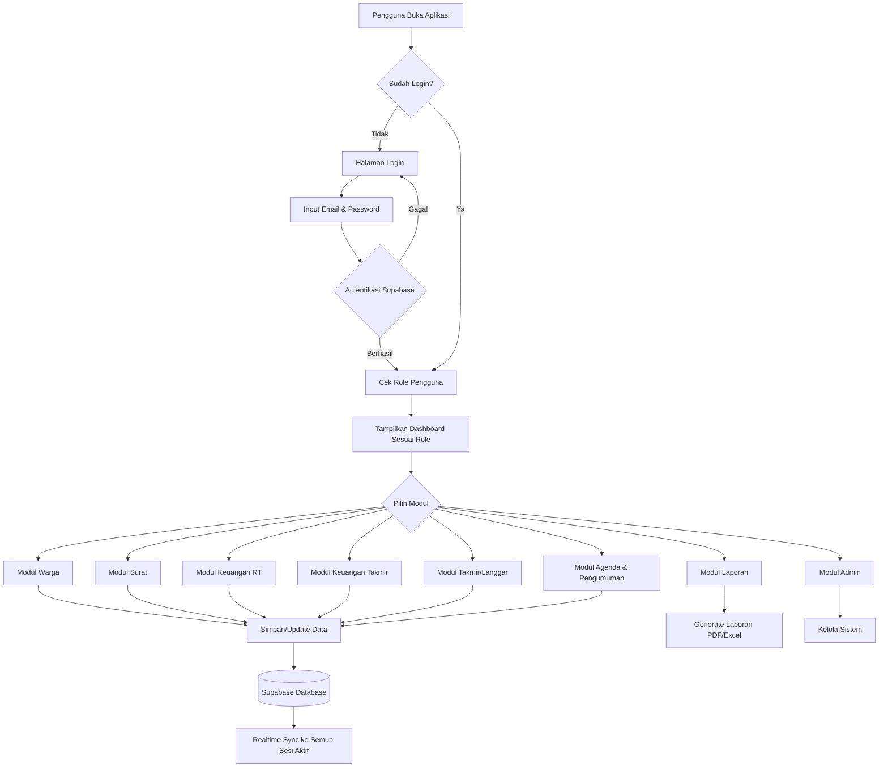
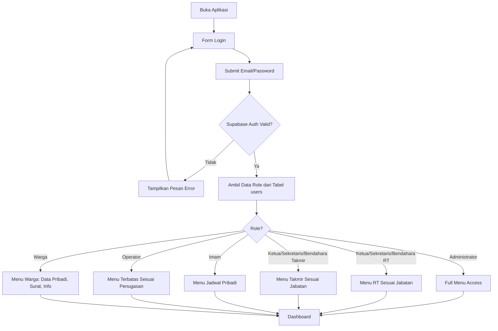
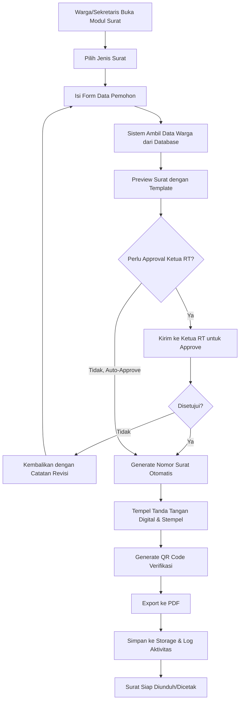
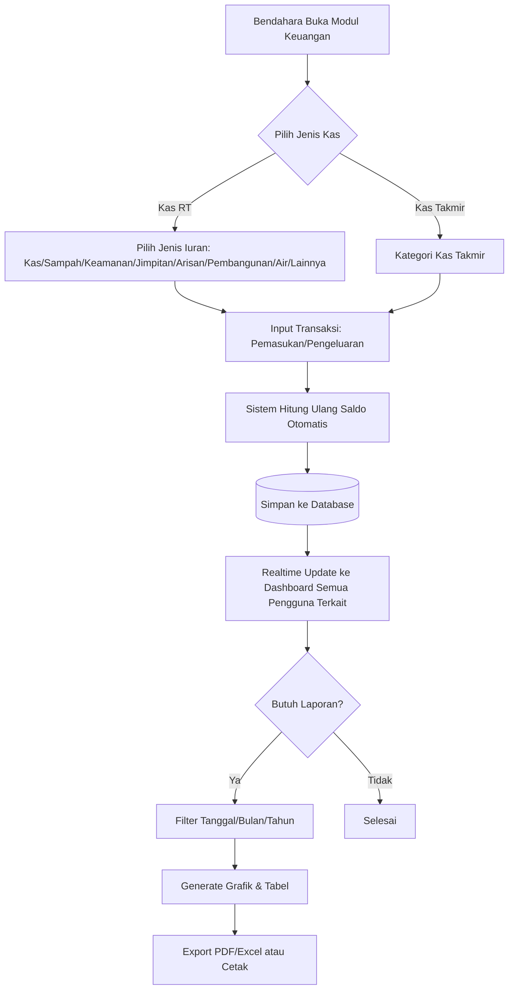
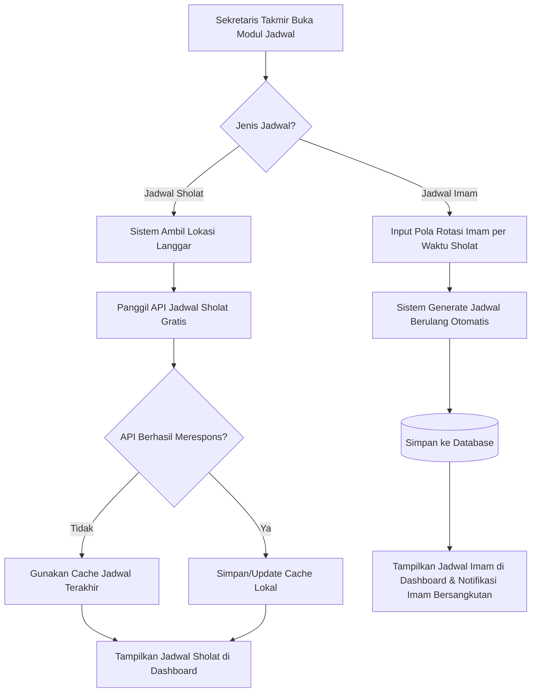
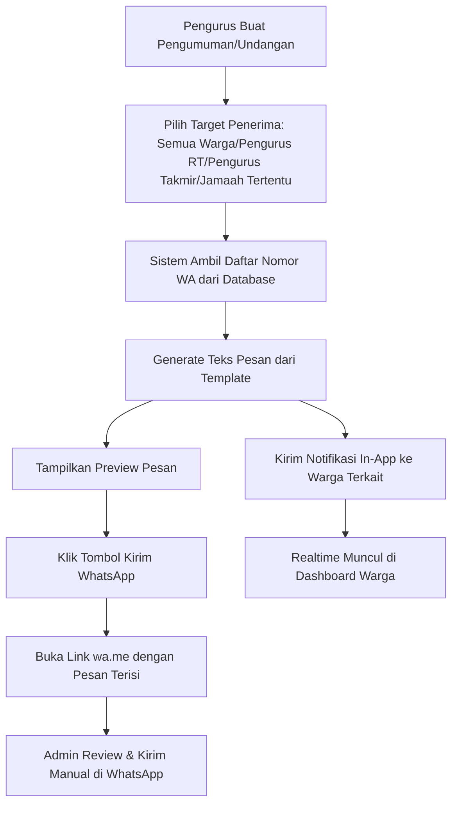
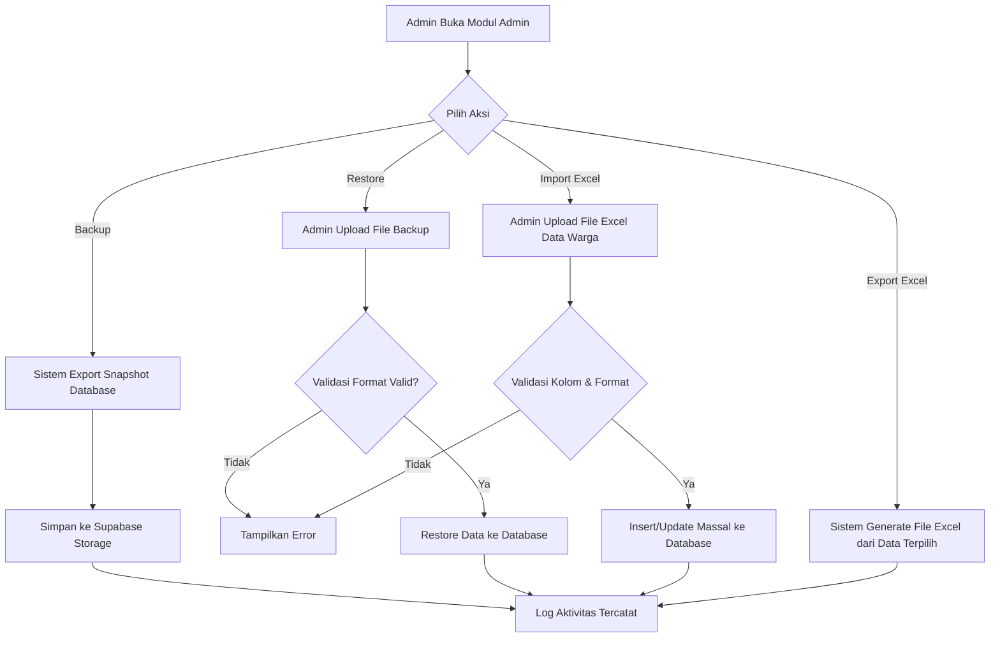

# TAHAP 2 — FLOWCHART SISTEM
## SILAT RT (Sistem Informasi Langgar dan RT)

---

## 1. FLOWCHART UMUM SISTEM (HIGH-LEVEL)

---

## 2. FLOWCHART LOGIN & OTORISASI ROLE

---

## 3. FLOWCHART PENGAJUAN & PENERBITAN SURAT

---

## 4. FLOWCHART TRANSAKSI KEUANGAN (RT & TAKMIR)

---

## 5. FLOWCHART JADWAL IMAM & JADWAL SHOLAT OTOMATIS

---

## 6. FLOWCHART PENGUMUMAN & SURAT UNDANGAN (VIA WHATSAPP)

---

## 7. FLOWCHART ADMIN: BACKUP, RESTORE, IMPORT/EXPORT

---

## 8. STATUS TAHAP

✅ **Tahap 2 selesai**: Flowchart sistem — alur umum, login & role, penerbitan surat, transaksi keuangan, jadwal imam/sholat, pengumuman via WhatsApp, dan admin (backup/restore/import/export).

Menunggu konfirmasi Anda sebelum lanjut ke **Tahap 3: Use Case Diagram**.
