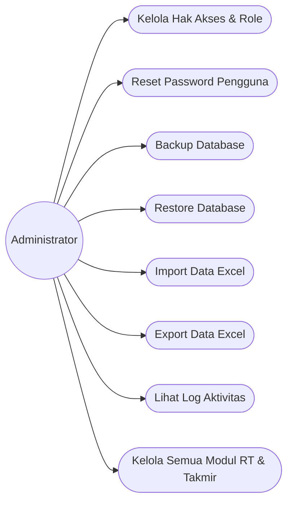
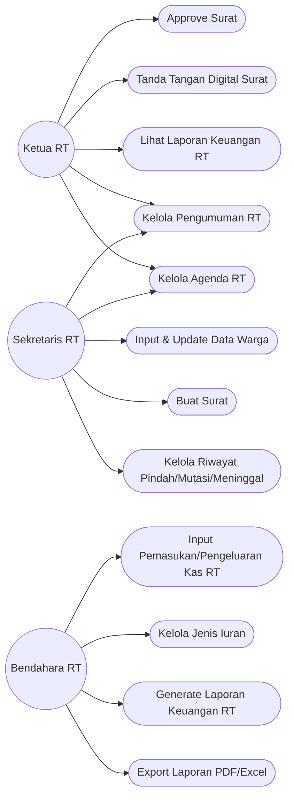
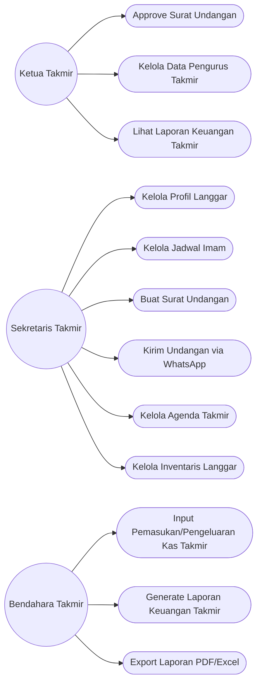
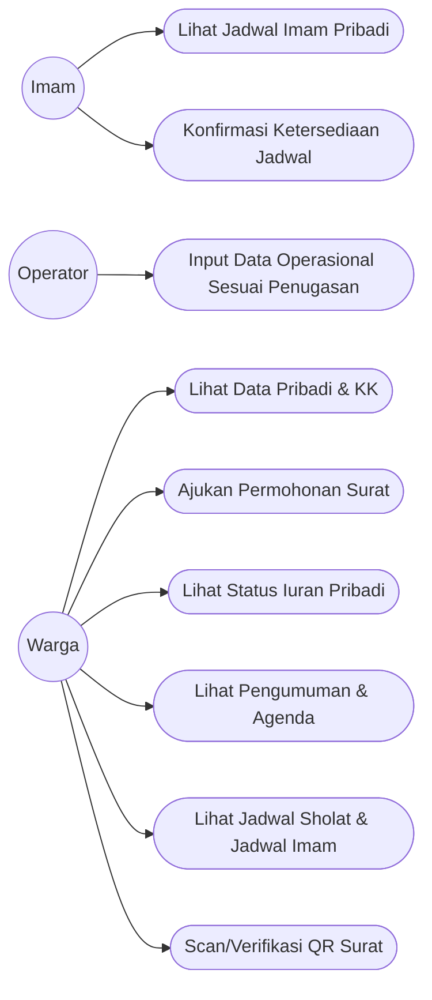
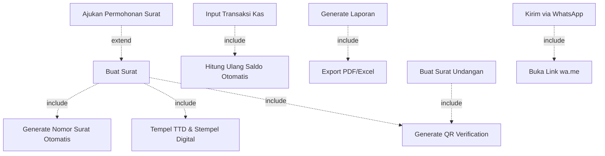

# TAHAP 3 — USE CASE DIAGRAM
## SILAT RT (Sistem Informasi Langgar dan RT)

---

## 1. DAFTAR AKTOR

| Aktor | Kelompok |
|---|---|
| Administrator | Sistem |
| Ketua RT, Sekretaris RT, Bendahara RT | Pengurus RT |
| Ketua Takmir, Sekretaris Takmir, Bendahara Takmir | Pengurus Takmir |
| Imam | Takmir |
| Operator | Operasional |
| Warga | Umum |

---

## 2. USE CASE DIAGRAM — AKTOR ADMINISTRATOR

---

## 3. USE CASE DIAGRAM — PENGURUS RT

---

## 4. USE CASE DIAGRAM — PENGURUS TAKMIR

---

## 5. USE CASE DIAGRAM — IMAM, OPERATOR, WARGA

---

## 6. RELASI INCLUDE/EXTEND PENTING

---

## 7. TABEL SPESIFIKASI USE CASE (RINGKASAN)

| Kode | Use Case | Aktor Utama | Precondition | Hasil Akhir |
|---|---|---|---|---|
| UC-16 | Buat Surat | Sekretaris RT | Data warga sudah ada di sistem | Surat PDF dengan nomor, TTD, QR |
| UC-18 | Input Transaksi Kas RT | Bendahara RT | Login sebagai Bendahara RT | Saldo terupdate, tercatat di log |
| UC-34 | Kelola Jadwal Imam | Sekretaris Takmir | Data pengurus/imam sudah ada | Jadwal berulang tersimpan |
| UC-36 | Kirim Undangan via WhatsApp | Sekretaris Takmir | Undangan sudah dibuat | Link wa.me terbuka dengan draf pesan |
| UC-54 | Ajukan Permohonan Surat | Warga | Warga sudah login & terdaftar | Permohonan masuk antrian approval |
| UC-58 | Scan/Verifikasi QR Surat | Siapa saja (publik) | Surat memiliki QR Code | Status keaslian surat ditampilkan |

---

## 8. STATUS TAHAP

✅ **Tahap 3 selesai**: Use Case Diagram lengkap per kelompok aktor (Administrator, Pengurus RT, Pengurus Takmir, Imam/Operator/Warga), relasi include/extend, dan tabel spesifikasi use case.

Menunggu konfirmasi Anda sebelum lanjut ke **Tahap 4: ERD (Entity Relationship Diagram)**.
