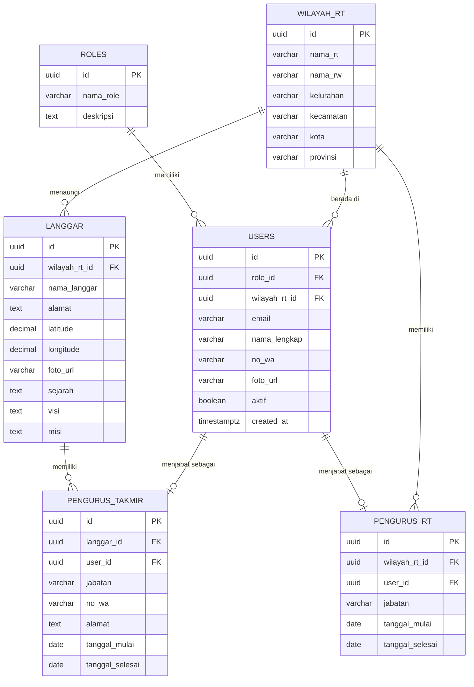
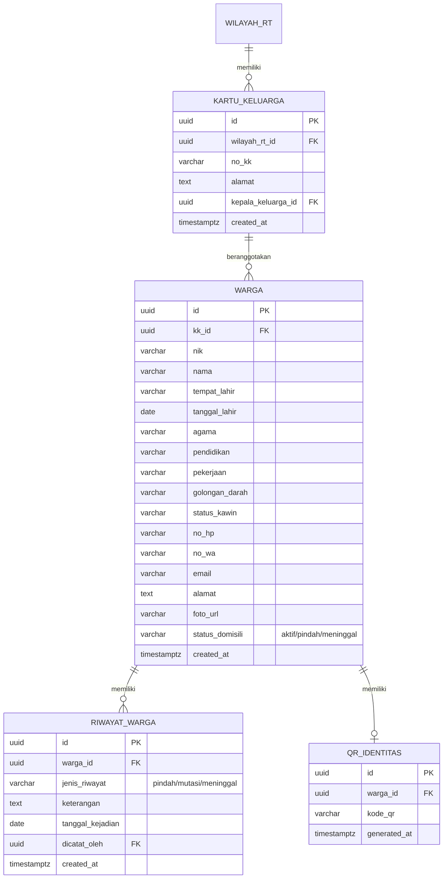
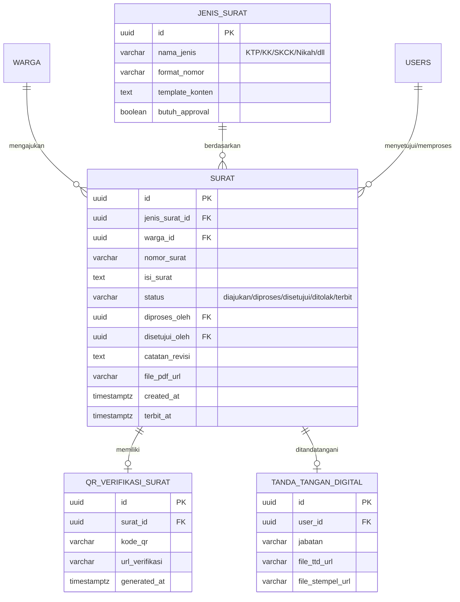
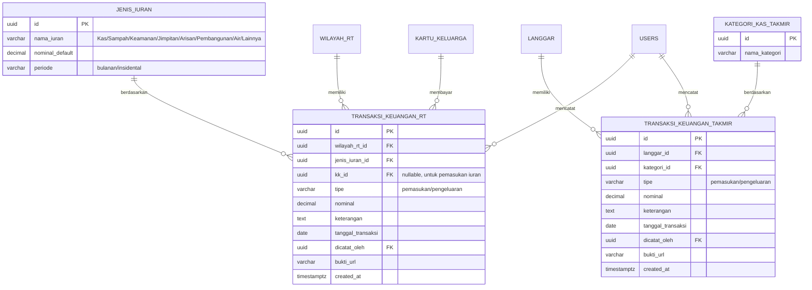
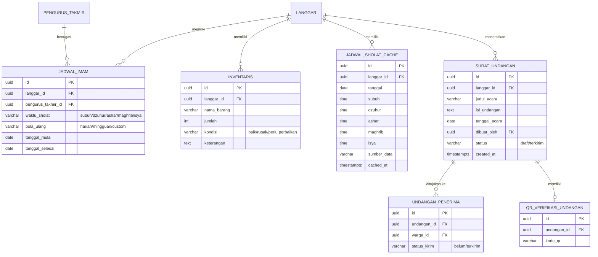
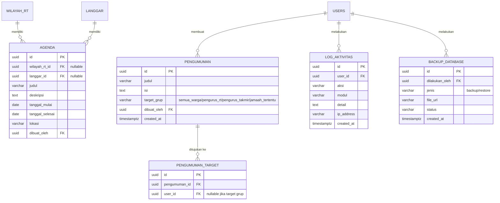

# TAHAP 4 — ERD (ENTITY RELATIONSHIP DIAGRAM)
## SILAT RT (Sistem Informasi Langgar dan RT)

Skema dirancang normal minimal 3NF, siap diimplementasikan sebagai PostgreSQL/Supabase pada Tahap 5.

---

## 1. ERD — DOMAIN INTI: PENGGUNA, WILAYAH, LANGGAR

---

## 2. ERD — DOMAIN KEPENDUDUKAN

---

## 3. ERD — DOMAIN SURAT-MENYURAT

---

## 4. ERD — DOMAIN KEUANGAN (RT & TAKMIR)

---

## 5. ERD — DOMAIN TAKMIR OPERASIONAL (JADWAL, INVENTARIS, UNDANGAN)

---

## 6. ERD — DOMAIN AGENDA, PENGUMUMAN, ADMIN & LOG

---

## 7. CATATAN NORMALISASI (3NF)

- Setiap tabel memiliki primary key `uuid` (menghindari collision saat sinkronisasi offline/realtime).
- Data historis (`RIWAYAT_WARGA`) dipisah dari tabel master `WARGA` agar tidak mengubah/menghapus data lama — mendukung audit trail.
- `TRANSAKSI_KEUANGAN_RT` dan `TRANSAKSI_KEUANGAN_TAKMIR` dipisah sesuai requirement (kas RT ≠ kas takmir), namun berbagi pola struktur yang sama untuk memudahkan query laporan gabungan bila diperlukan admin.
- `JENIS_SURAT`, `JENIS_IURAN`, `KATEGORI_KAS_TAKMIR` dijadikan tabel referensi terpisah (bukan enum tetap) sehingga admin dapat menambah jenis baru tanpa mengubah skema.
- `JADWAL_SHOLAT_CACHE` memisahkan data dari API eksternal agar sistem tetap berjalan (fallback) saat API down — bukan dependensi langsung tiap request.
- Tidak ada atribut multi-nilai dalam satu kolom (mis. daftar penerima undangan dipecah ke `UNDANGAN_PENERIMA`, bukan disimpan sebagai array di satu baris) — memenuhi 1NF/2NF/3NF sekaligus.

---

## 8. RENCANA INDEX & CONSTRAINT (akan diimplementasikan penuh di Tahap 5)

| Tabel | Index/Constraint Utama |
|---|---|
| WARGA | UNIQUE(nik), INDEX(kk_id), INDEX(status_domisili) |
| SURAT | INDEX(warga_id), INDEX(status), UNIQUE(nomor_surat) |
| TRANSAKSI_KEUANGAN_RT | INDEX(wilayah_rt_id, tanggal_transaksi), INDEX(jenis_iuran_id) |
| TRANSAKSI_KEUANGAN_TAKMIR | INDEX(langgar_id, tanggal_transaksi) |
| JADWAL_SHOLAT_CACHE | UNIQUE(langgar_id, tanggal) |
| LOG_AKTIVITAS | INDEX(user_id, created_at) |
| USERS | UNIQUE(email) |

Foreign key seluruh tabel menggunakan `ON DELETE RESTRICT` untuk data transaksi/legal (surat, keuangan, riwayat) dan `ON DELETE CASCADE` untuk data anak yang murni dependen (mis. `PENGUMUMAN_TARGET`, `UNDANGAN_PENERIMA`).

---

## 9. STATUS TAHAP

✅ **Tahap 4 selesai**: ERD lengkap 6 domain (Pengguna/Wilayah/Langgar, Kependudukan, Surat, Keuangan, Takmir Operasional, Agenda/Pengumuman/Admin), catatan normalisasi 3NF, serta rencana index & constraint.

Menunggu konfirmasi Anda sebelum lanjut ke **Tahap 5: Struktur Database Supabase (SQL Schema + RLS)**.
