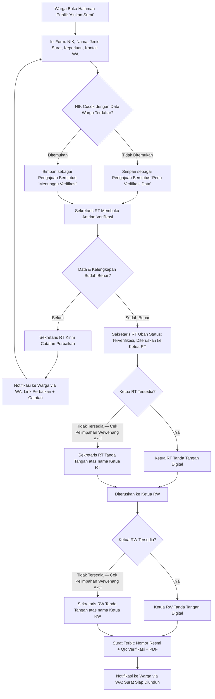

# REVISI — ALUR PENGAJUAN SURAT, ROLE RW & PELIMPAHAN WEWENANG
## Menyesuaikan Tahap 1 (Kebutuhan), 3 (Use Case), 4 (ERD), 5 (Database)

---

## 1. LOKASI & IDENTITAS RESMI (data akhir, menggantikan placeholder sebelumnya)

| Item | Nilai |
|---|---|
| RT | RT 01 |
| RW | RW 09 |
| Kelurahan | Purwantoro |
| Kecamatan | Blimbing |
| Kota | Malang |
| Nama Langgar | Langgar Waqaf Al Muchtarom Pandean 1 |

---

## 2. ROLE BARU: TINGKAT RW

Sebelumnya sistem hanya berhenti di tingkat RT. Sekarang surat perlu diteruskan ke RW untuk tanda tangan berjenjang. Role baru ditambahkan ke tabel `roles` (lihat SQL patch):

| Role Baru | Fungsi |
|---|---|
| Ketua RW | Tanda tangan tahap akhir surat pengantar tingkat RW |
| Sekretaris RW | Verifikasi administratif tingkat RW & TTD atas nama Ketua RW bila didelegasikan |

Karena satu RW menaungi beberapa RT, struktur wilayah perlu 1 level baru: `wilayah_rw` sebagai induk dari `wilayah_rt` (1 RW → banyak RT). Untuk implementasi awal (1 RT aktif di RW 09), tabel tetap disiapkan agar siap berkembang ke RT lain di RW yang sama.

---

## 3. ALUR BARU: PENGAJUAN SURAT KEPENDUDUKAN (PUBLIK, TANPA LOGIN)

**Status surat (state machine) — menggantikan status lama yang lebih sederhana:**

`draf_publik` → `menunggu_verifikasi` → `perlu_perbaikan` (bisa kembali ke `menunggu_verifikasi`) → `terverifikasi_sekretaris_rt` → `ditandatangani_rt` → `diteruskan_rw` → `ditandatangani_rw` → `terbit` | `ditolak`

---

## 4. PELIMPAHAN WEWENANG (DELEGASI TANDA TANGAN)

Tabel baru `pelimpahan_wewenang` mencatat kapan seorang pejabat (Ketua RT/Ketua RW) berhalangan dan siapa yang berwenang menandatangani atas namanya:

| Kolom | Keterangan |
|---|---|
| `pemberi_wewenang_id` | User Ketua RT/RW yang berhalangan |
| `penerima_wewenang_id` | User Sekretaris RT/RW yang mewakili |
| `alasan` | Dinas luar kota, umroh, haji, sakit, cuti, dll (bebas isi) |
| `tanggal_mulai` / `tanggal_selesai` | Rentang aktif delegasi |
| `status` | aktif / berakhir / dibatalkan |

Ketika sistem memproses tanda tangan dan mendeteksi pejabat berwenang tidak tersedia (dicek dari `pelimpahan_wewenang` yang aktif pada tanggal berjalan), tanda tangan digital yang dipakai adalah milik penerima wewenang, namun **jabatan yang tercetak di surat tetap "Ketua RT/RW" dengan keterangan "u.b." (untuk beliau)** — konvensi administrasi Indonesia yang lazim.

---

## 5. PERUBAHAN PADA ERD & SKEMA (ringkasan — detail di file SQL patch)

- Tabel baru: `wilayah_rw`, `pelimpahan_wewenang`
- Tabel `wilayah_rt` mendapat kolom `wilayah_rw_id` (FK)
- Tabel `surat` mendapat kolom tambahan: `ditandatangani_rt_oleh`, `ditandatangani_rw_oleh`, `atas_nama_pelimpahan_id` (nullable, isi jika pakai delegasi), `catatan_perbaikan`, dan `status` diperluas sesuai state machine baru
- Role baru: `Ketua RW`, `Sekretaris RW` ditambahkan ke tabel `roles`
- RLS: policy `surat` diperluas agar Sekretaris RW dan Ketua RW juga bisa melihat/memproses surat yang sudah pada tahap `diteruskan_rw`, dan endpoint pengajuan publik (`insert` ke tabel `surat` + tabel baru `pengajuan_publik`) dibuka untuk `anon` role dengan validasi ketat di level constraint (bukan RLS penuh, karena belum ada sesi login)

---

## 6. STATUS

✅ Revisi kebutuhan, alur, dan skema tercatat. File SQL patch (`05e`) dan pembaruan flowchart/ERD ringkas disertakan. Lanjut ke **Tahap 8: Source Code Frontend** dengan alur ini sebagai acuan implementasi modul Surat.
